# Doing Data Science - Case Study 01: Using the Beer and Breweries Datasets
## By: Satvik Ajmera and Rob Burigo

[Link to Github Repository](https://github.com/sajmera9/BeerCaseStudy1)

## Analysis

### 1. How many breweries are present in each state?

For this question, we decided to focus on the top ten states with the most breweries. We found that Colorado has the most breweries with 47, followed by California with 39 breweries, and Michigan with 32 breweries. Here is the plot we created:

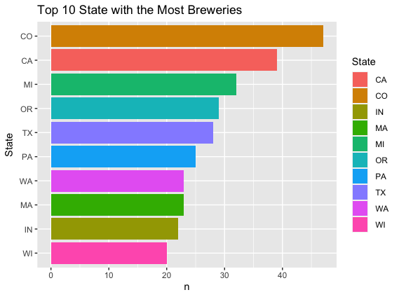

### 2. Merge beer data with the breweries data. Print the first 6 observations and the last six observations to check the merged file.  (RMD only, this does not need to be included in the presentation or the deck.)

To successfully merge the `beer.csv` and `breweries.csv` , we merged on the unique identifier columns that were in both datasets called `Brewery_id` and `Brew_ID`. Lastly, we concatenated the first and last six observations into one dataframe called `head_tail_merge`. Here is a screenshot of what that dataframe looks like:

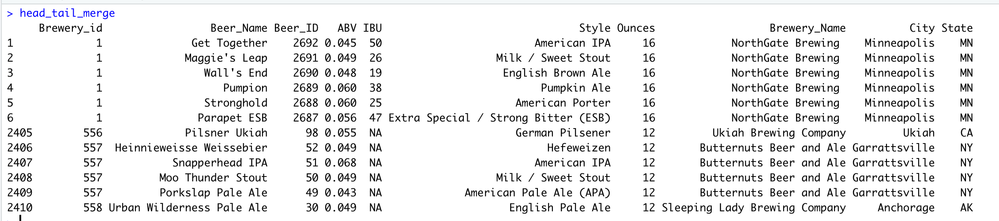

### 3. Address the missing values in each column.

Using the `naniar` library in R, we found that there are **62** missing values for ABV and **1005** missing values for IBU after merging the both datasets. Going forward, we decided to drop all these NA values. We created a visualization of the missing values in column to visually compare them.

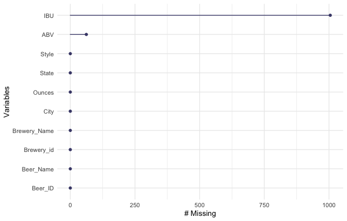

### 4. Compute the median alcohol content and international bitterness unit for each state. Plot a bar chart to compare.

Using a `group_by()`, and `summarize()` we computed the median ABV and median IBU per state.

For our visualization, we wanted to focus on the top ten states with highest median ABV. We found the top 9 states have a median ABV over **5.5%**. The state with the highest median ABV is Colorado with 6.5%, followed by Florida with 6.2% and Connecticut with 6.1%. If we were planning on making beer with higher alcohol content, we should consider selling that beer to the following states in the visualization.

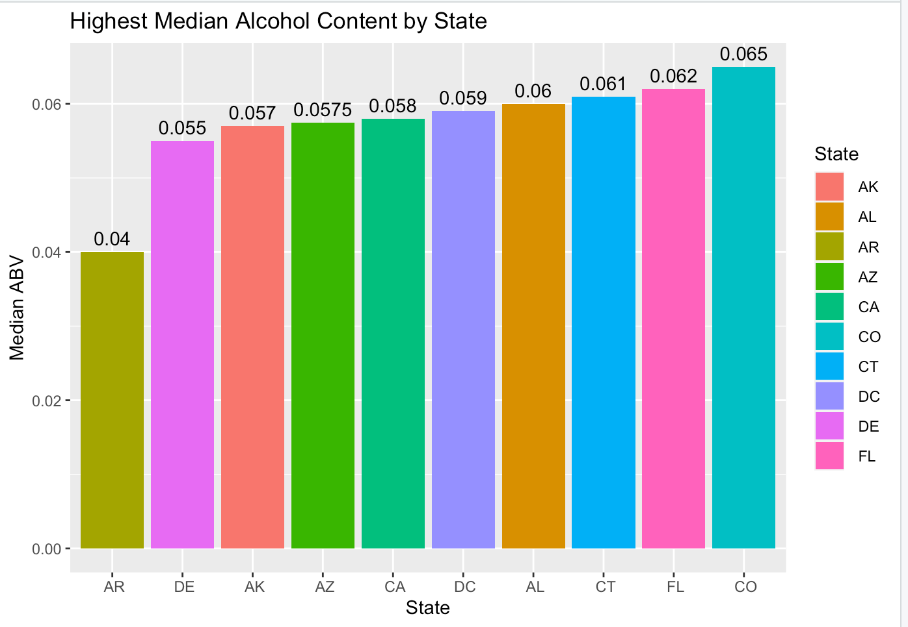

Similarly, we focused on the top ten states with the highest median IBU. We see that the top 8 states have a median IBU over **38**. Furthermore, some of the top states with a high median IBU are also top states with the highest median ABV. We should consider the importance of the IBU when making and selling beers in states.

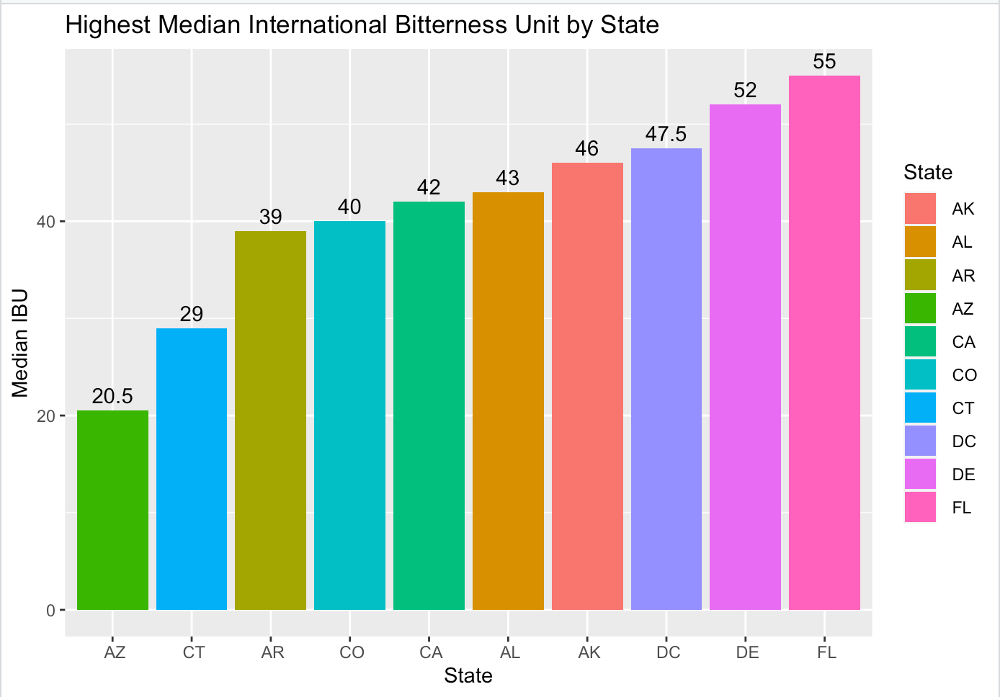

### 5. Which state has the maximum alcoholic (ABV) beer? Which state has the most bitter (IBU) beer?

Kentucky has the maximum alcohol beer with an ABV of **12.5%**. Oregon has the most bitter beer with an IBU of **138**. Below are visualizations that show the top five states with the maximum ABV and IBU:

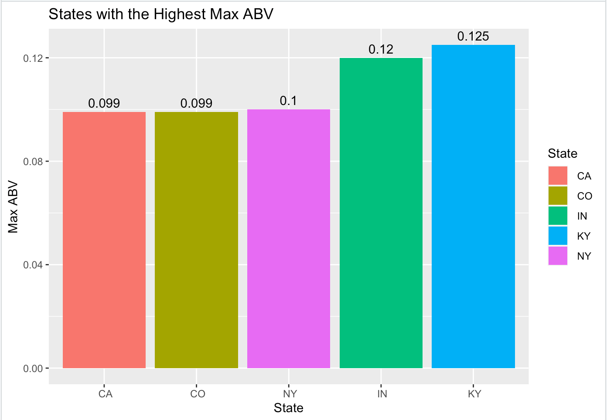
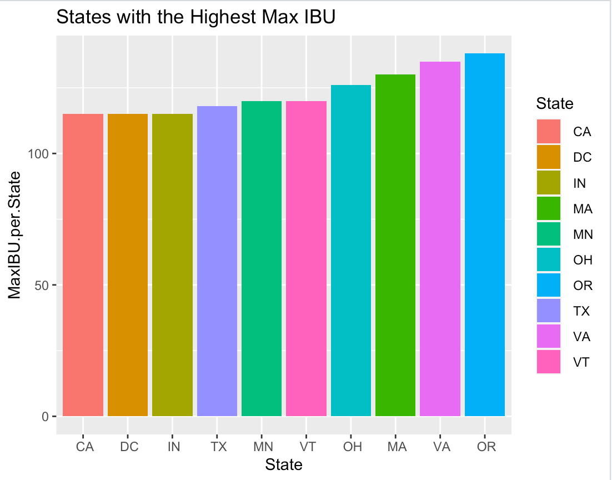

### 6. Comment on the summary statistics and distribution of the ABV variable.

Looking at the ABV box plot below. There is some visual evidence of outliers in the data. Looking at the ABV histogram below, there is evidence that the data is slightly right-skewed and the mean is greater than the median.

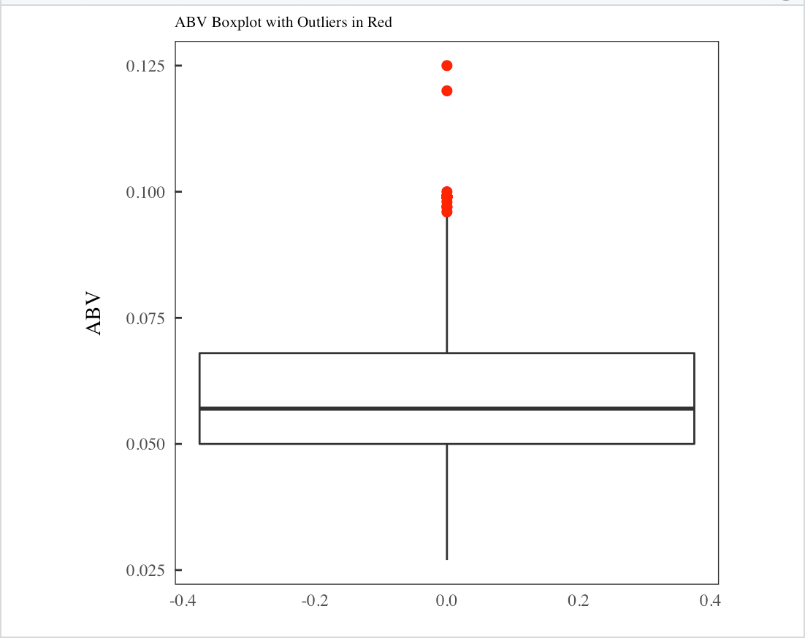

### 7. Is there an apparent relationship between the bitterness of the beer and its alcoholic content? Draw a scatter plot.  Make your best judgment of a relationship and EXPLAIN your answer.

There is visual evidence of a positive relationship between IBU and ABV. If there is a beer with higher IBU it is likely to have a higher ABV (and vice-versa). Additionally, we plotted the linear regression line to prove even further of the positive relationship (slope of line is positive).

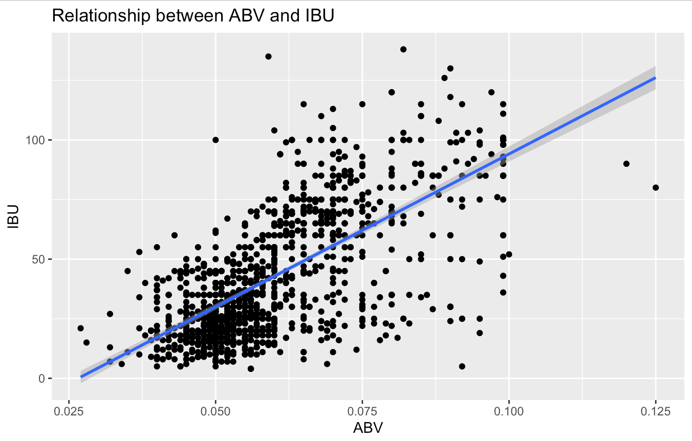

### 8. Budweiser would also like to investigate the difference with respect to IBU and ABV between IPAs (India Pale Ales) and other types of Ale (any beer with “Ale” in its name other than IPA).  You decide to use KNN classification to investigate this relationship.  Provide statistical evidence one way or the other. You can of course assume your audience is comfortable with percentages … KNN is very easy to understand conceptually.

Before we used the KNN, we wanted to compare all IPA's to any beer with "Ale" in its name. So, we used grepl() and if-else statement to find and rename all IPA beers to "IPA", all Ale Beers are renamed to "Other Ale", and other beers are renamed to "other". After, filtering out "other" beers, we can proceed with find the best value for k. So, we ran a loop that take different iterations of a 75%-25% train/test split and averages our accuracy for each value of k. We found that the best value of k = 5.

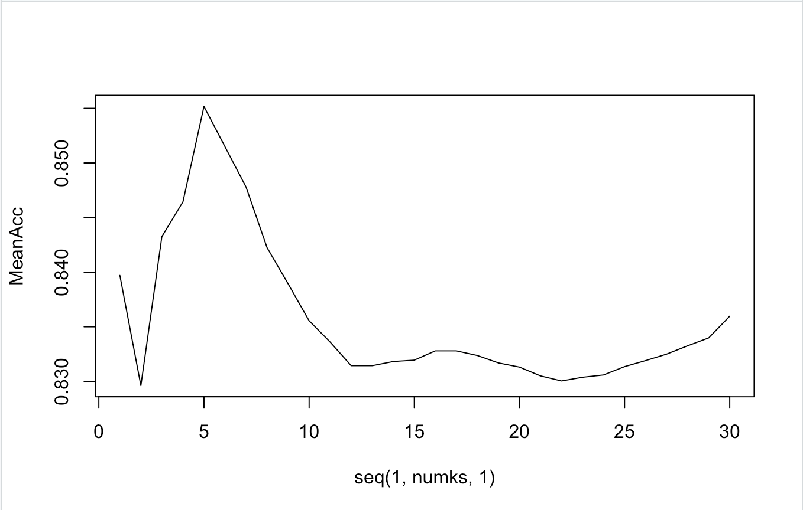

Finally, we ran the KNN with a 75%-25% train/test split. We were able to predict whether the beer was an "IPA" or "Other Ale" using IBU and ABV with an accuracy of approximately 84.75%. Below is a screenshot of our confusion matrix.

Additionally, we created a prediction cluster plot, to better visualize how the KNN is classifying beers as IPAs or Ales. Looking at these clusters, we see that IBU is a stronger predictor when a beer is being classified as an Ale or IPA.  Higher IBU has a stronger chance of being an IPA than does higher ABV (There is still a positive relationship, just not as strong).

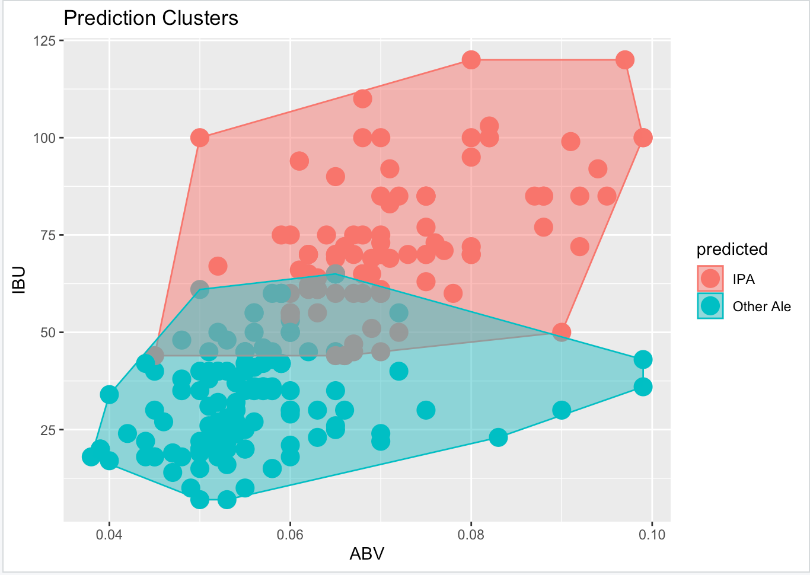

### 9. Knock their socks off!  Find one other useful inference from the data that you feel Budweiser may be able to find value in.  You must convince them why it is important and back up your conviction with appropriate statistical evidence. 

#### Question of Interest:

Are the IBU, ABV, and Ounces different based on a region? Could we accurately predict the region of a beer using the IBU, ABV and Ounces variables using a KNN?  

##### Why is this important?
 
Normally, the distribution of beer is based on the region. It can become too expensive for a beer producer to tailor operations for each state. Rathering than producing beer for each state, it is more economic to understand what beers are commonly sold in a region. This research can benefit a beer producer, because they would be able to produce, distribute, and market beer more effectively.

##### Tidying the Data:

Before using a KNN, we wanted to group all the beers into the Northeast, Midwest, South and West regions. Then, we wanted to gain inference on the distribution of IBU, ABV and Ounces. So we created two visualizations of the distributions of ABV and IBU per region below:

[put distribution plot here.]
ABV appears to follow a somewhat normal distribution among regions with the most common being around .06. IBU appears to follow a right skewed distribution among regions with the most common IBU value being around 20.

##### Building the KNN Model:

We ran the loop to find that the best k value is 30. Then, we ran the KNN with IBU, ABV, and Ounces variables. Our accuracy was approximately 40%. Here is the prediction clusters. As you can see there is a lot of overlap between regions when looking at IBU vs ABV. This overlap shows how each region has similar characteristics to their beer.

[put prediction cluster viz here.]

##### Conclusion:

There really isn't too much of a difference in beers between regions.  We were able to out-perform the control by 15% (25% compared to ~40%).  This means that while we can get a little out of the characteristics of the beer to tell what region it is from, we still were not able to predict the region of a beer with high accuracy.  This means that in terms of taste and components of beer, we can market consistently among the regions.
 
##### Other Noteworthy Insights:

The Northeast is a potential market for growth.  There aren't too many beers that are specific and unique to the Northeast. This means there is potential to penetrate that market with a unique beer and create a strong brand.