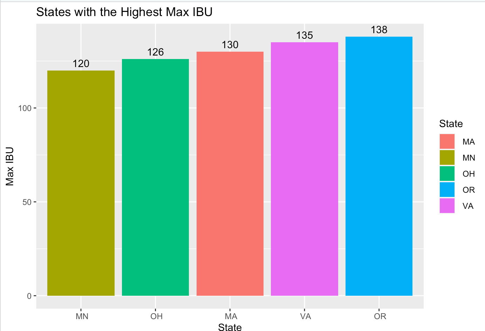
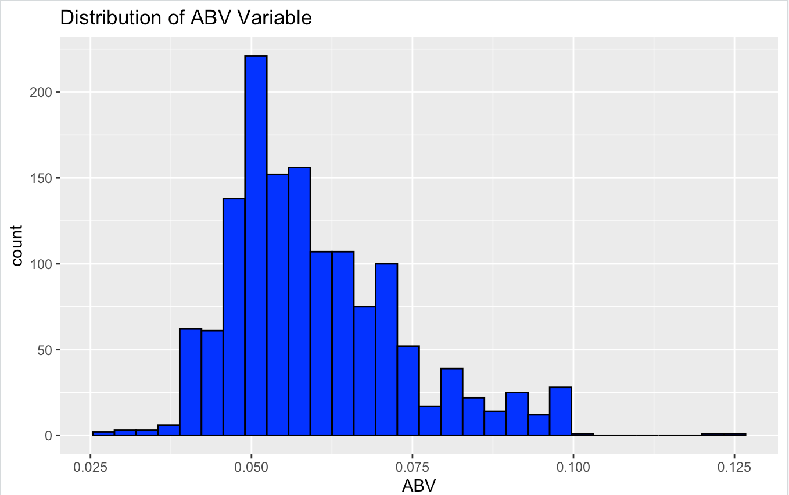
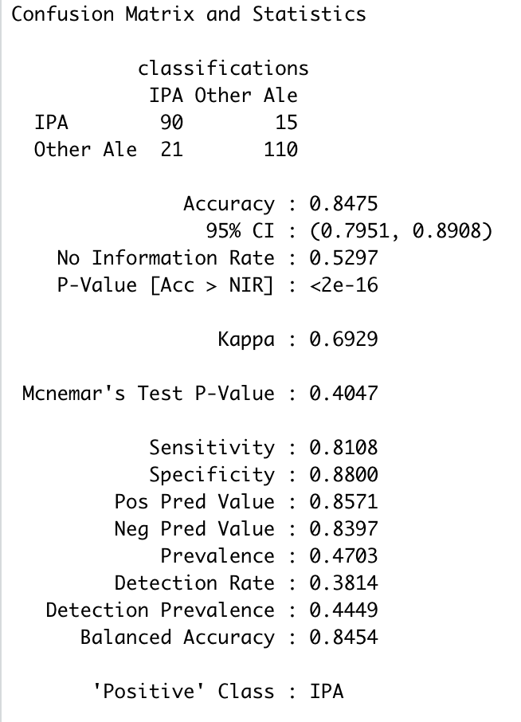

# Doing Data Science - Case Study 01: Using the Beer and Breweries Datasets
## By: Satvik Ajmera and Rob Burigo

[Link to Github Repository](https://github.com/sajmera9/BeerCaseStudy1)

## Analysis

### 1. How many breweries are present in each state?

For this question, we decided to focus on the top ten states with the most breweries. We found that Colorado has the most breweries with 47, followed by California with 39 breweries, and Michigan with 32 breweries. Here is the plot we created:

### 2. Merge beer data with the breweries data. Print the first 6 observations and the last six observations to check the merged file.  (RMD only, this does not need to be included in the presentation or the deck.)

To successfully merge the `beer.csv` and `breweries.csv` , we merged on the unique identifier columns that were in both datasets called `Brewery_id` and `Brew_ID`. Lastly, we concatenating first and last six observations into one dataframe called `head_tail_merge`. Here is a screenshot of what that dataframe looks like:

### 3. Address the missing values in each column.

Using the `naniar` library in R, we found that there are 62 missing values for ABV and 1005 missing values for IBU after merging the both datasets. Going forward, we decided to drop all these NA values. We created a visualization of the missing values in column to visually compare them.

### 4. Compute the median alcohol content and international bitterness unit for each state. Plot a bar chart to compare.

Using a `group_by()`, and `summarize()` we computed the median ABV and median IBU per state. 

For our visualization, we wanted to focus on the top ten states with highest median ABV. We found the top 9 states have a median ABV over **5.5%**. The state with the highest median ABV is Colorado with 6.5%, followed by Florida with 6.2% and Connecticut with 6.1%. If we were planning on making beer with higher alcohol content, we should consider selling that beer to the following states in the visualization.

Similarly, we focused on the top ten states with the highest median IBU. We see that the top 8 states have a median IBU over **38**. Furthermore, some of the top states a high median IBU are top states with the highest median ABV. We should consider the importance of the IBU when making and selling beers in states.

### 5. Which state has the maximum alcoholic (ABV) beer? Which state has the most bitter (IBU) beer?

Kentucky has the maximum alcohol beer with an ABV of **12.5%**. Oregon has the most bitter beer with an IBU of **138**. Below are visualizations that show the top five states with the maximum ABV and IBU:

### 6. Comment on the summary statistics and distribution of the ABV variable.

Looking at the ABV box plot below. There some visual evidence of outliers in the data. Looking at the ABV histogram below, there is evidence that the data is slightly right-skewed and the mean is greater than the median.

### 7. Is there an apparent relationship between the bitterness of the beer and its alcoholic content? Draw a scatter plot.  Make your best judgment of a relationship and EXPLAIN your answer.

There is visual evidence of a positive relationship between IBU and ABV. If there is a beer with higher IBU it is likely to have a higher ABV (and vice-versa). Additionally, we plotted the linear regression line to prove even further of the positive relationship (slope of line is positive).

### 8. Budweiser would also like to investigate the difference with respect to IBU and ABV between IPAs (India Pale Ales) and other types of Ale (any beer with “Ale” in its name other than IPA).  You decide to use KNN classification to investigate this relationship.  Provide statistical evidence one way or the other. You can of course assume your audience is comfortable with percentages … KNN is very easy to understand conceptually.

Before we used the KNN, we wanted to compare all IPA's to any beer with "Ale" in its name. So, we used grepl() and if-else statement to find and renamed all IPA beers to "IPA", all Ale Beers are renamed as "Other Ale", and any other beer is renamed as "other". After, filtering out "other" beers, we can proceed with find the best k. So, we ran a loop that take different iterations of a 75%-25% train/test split and averages our accuracy for each value of k. We found that the best value of k = 5.

Finally, we ran the KNN with a 75%-25% train/test split. We were able to predict whether the beer was an "IPA" or "Other Ale" using IBU and ABV with an accuracy of approximately 84.75%. Below is a screenshot of our confusion matrix.

### In addition, while you have decided to use KNN to investigate this relationship (KNN is required) you may also feel free to supplement your response to this question with any other methods or techniques you have learned.  Creativity and alternative solutions are always encouraged.  

### 9. Knock their socks off!  Find one other useful inference from the data that you feel Budweiser may be able to find value in.  You must convince them why it is important and back up your conviction with appropriate statistical evidence. 
